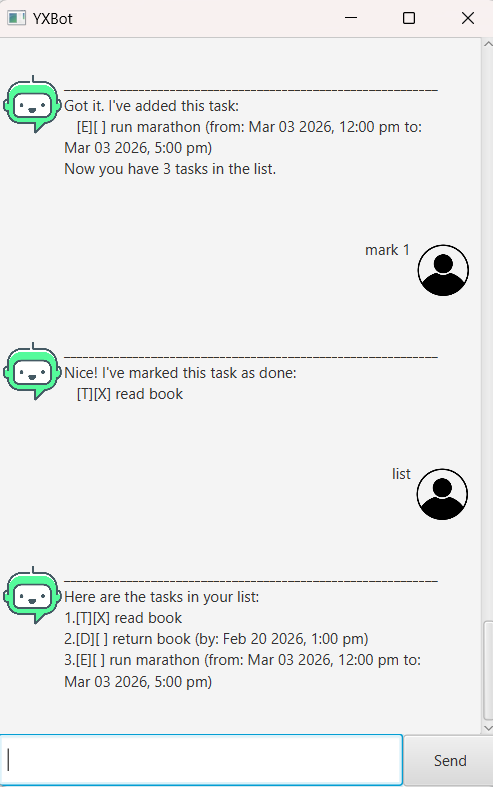

# YXBot User Guide



YXBot is a task manager chatbot that allows you to manage tasks efficiently using simple commands.

---

## Quick Start

### Prerequisites

- Java 17 or above must be installed on your computer.
- Ensure `java` is available in your system PATH.

---

### Running the JAR File
- Download the `YXBot.jar` file. 
- Open a terminal (Command Prompt / PowerShell / Terminal).
- Navigate to the folder containing the JAR file.

Example:

```
cd path/to/your/jar/folder
```

- Run the following command:

```
java -jar YXBot.jar
```

- The YXBot GUI window will launch.

## Features

---
## list

Displays all tasks in the list.

**Format**
```
list
```

---

## todo

Adds a todo task.

**Format**
```
todo DESCRIPTION
```

**Example**
```
todo finish assignment
```

---

## deadline

Adds a task with a deadline.

**Format**
```
deadline DESCRIPTION /by yyyy-MM-dd HHmm
```

**Example**
```
deadline submit report /by 2026-12-20 2359
```

Date must follow `yyyy-MM-dd HHmm`.

---

## event

Adds a task with start and end time.

**Format**
```
event DESCRIPTION /from yyyy-MM-dd HHmm /to yyyy-MM-dd HHmm
```

**Example**
```
event project meeting /from 2026-12-12 1400 /to 2026-12-12 1600
```

- End time must be after start time.
- Date format: `yyyy-MM-dd HHmm`.

---

## mark

Marks a task as completed.

**Format**
```
mark INDEX
```

---

## unmark

Marks a task as not done.

**Format**
```
unmark INDEX
```

---

## delete

Deletes a task.

**Format**
```
delete INDEX
```

---

## find

Finds tasks containing a keyword (case-insensitive).

**Format**
```
find KEYWORD
```

---

## bye

Exits YXBot.

**Format**
```
bye
```

---

## Notes

- Task numbering starts from **1**.
- Tasks are automatically saved after modifications.
- Invalid input will show an error message.
- Duplicate tasks cannot be added
